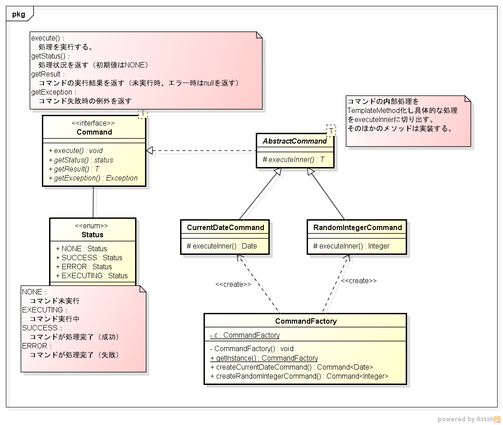

# abstract-class-test
## 概要
本リポジトリは、[java 100 本ノック](https://github.com/JustSystems/java-100practices)の [73 本目](https://github.com/JustSystems/java-100practices/tree/master/contents/073)を題材に、抽象クラスのテストを実装するリポジトリである。

## 問題
- リーダーから、以下のクラス図が渡された。クラス図の設計意図を読み取り、実装せよ。
    - `CurrentDateCommand`は、「現在日時を表すDate」、`RandomIntegerCommand`は、ランダムな数値を返すコマンドとして実装せよ。

